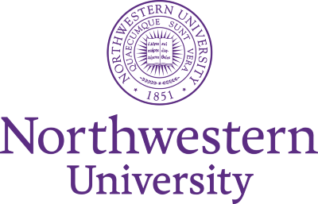

------
I am a second year Master's student, majoring in Computer Science from [Northwestern University](https://www.mccormick.northwestern.edu/computer-science/), working on developing secure-MPC Databases as a part of [Prof. Jennie Rogers'](http://users.eecs.northwestern.edu/~jennie/) research group. I am currently working in the capacity of a Graduate Research Assistant in the NSF-funded private data federation project: VaultDB, in collaboration with the [CAPriCORN initiative](https://www.capricorncdrn.org/), which is slated to be deployed on 5 major hospitals in the Chicagoland area. I completed my Bachelor's of Engineering (with HONORS) degree in Computer Science & Engineering from Rajiv Gandhi Technological Institute, India.

My primary research domain comprises of <strong>Database Systems</strong> and <strong>Data Science</strong>.

I aim to contribute to developing massively distributed cloud database systems which can span the limitations of physical storage and proximity. Besides that, my summer of 2020 was spent developing a quantitative trading platform for Practicum LLC, through which I gained in-depth knowledge of web developement, financial market paradigms, and also got a chance to develop statisticlaly proven algortihms for first-time quant traders to experiment with.

Having previously collaborated on large codebases through my prior projects, I've developed a thorough understanding of fairly advanced concepts in programming, data structures, and algorithms, with JAVA being my core programming language. I've had an opportunity to develop and deploy scalable Distributed Systems, and have had an extensive project roster encompassing data science, algorithmic trading, and network analysis. I have previously worked on projects involving full-stack web development at scale.

Education
-----

**Master's of Science (M.S.)  Computer Science**
#### Northwestern University, Evanston (IL) Sep 2019 - Mar 2021 (expected)
-----
<strong>GPA: </strong> 3.827/4.0  
<strong>Relevant Coursework: </strong>
Distributed Systems, Database Systems, Operating Systems, Intensive Program Design, Data Science, Social Network Analysis, Machine Learning Foundations, Statistical Language Modelling, Intelligent Information Systems 
<strong>Labs</strong>: Database Systems and Security Research Lab, Northwestern Neighborhood and Network Initiative

-----

**Bachelor's of Engineering (B.E. HONS) Computer Science & Engineering**
#### Rajiv Gandhi Proudyogiki Vishwavidyalaya, Bhopal (India) Aug 2015 - Jun 2019 
-----
<strong>CGPA: </strong> 8.63/10.0  
<strong>Relevant Coursework: </strong>
Algorithms, Data Structures, Cloud Computing, Object Oriented Design, Software Development Life Cycle  
<strong>Accolades:</strong>  * *Finalist* - Smart India Hackathon, 2019 (Software Edition)  * *Winner* - Wireless Robotics Competition, IIT - Kanpur (Zonal Round)

-----

Experience
-----

**Quantitative Data Analyst Institute for Policy Research (N3 Lab)**
#### Evanston, Illinois Dec 2020 - Present
-----
I am working on an active social policy research study at the [Northwestern Neighborhood and Network (N3) Initiative](https://sites.northwestern.edu/n3lab/) where I modelled the co-evolution of the Chicago Police Department’s official assignment & attendance network data with 22 years’ worth of police misconduct data ([Invisible Institute's CPDP](https://invisible.institute/police-data)) to analyze the formation, evolution and cross-network dependence of officer ties. My primary role was to define and calibrate network boundaries after extensive cleaning and detailed exploratory analysis in GCP’s BigQuery engine. I also managed to identify the individual, organizational, and neighborhood factors responsible for burgeoning misconduct through police networks using the [Goldfish library](https://github.com/snlab-ch/goldfish) in R. I'm currently working on adding additional network dynamic effects, ones which aren't included out-of-the-box but are critical to our further analysis, and contributing them to this open-source library in C++. 
**PI:** [Prof. Andy Papachristos](http://www.papachristos.org/about.html)

-----

**Graduate Research Assistant Northwestern University**
#### Evanston, Illinois Jan 2020 - Present
-----
I am part of the Database systems research group at Northwestern, working towards creating operators for securely querying federated databases (provided by [HealthLNK](https://www.healthinformationforall.org/project/healthlnk/)) for hospitals in Chicagoland, as part of a pilot project. My key responsibilities included: 1. Developing and Testing aggregate functionality in secure and plaintext settings. 2. Generating and deploying build pipleine for the ubuntu VMs in Docker with all necessary dependencies to run secure multi-party computation. 3. Query plan enumeration to incorporate operator reordering for the query optemizer using Apache Calcite's algebra, among others. 
**Advisors:** [Prof. Jennie Rogers](https://www.mccormick.northwestern.edu/research-faculty/directory/profiles/rogers-jennie.html), [Prof. Xiao Wang](https://www.mccormick.northwestern.edu/research-faculty/directory/profiles/wang-xiao.html) (Co-Advisor)

-----

**Backend Engineering Intern/Quantitative Developer Practicum LLC**
#### St. Louis, Missouri (Remote) Jun 2020 - Aug 2020
-----
I spent summer of 2020 working as a backend developer. I conceptualized a solid schema design with future scalability in mind, and engineered it through endpoints in Flask, using JSON and MySQL to work seemlessly with the Figma-designed front end. The latter half comprised of realizing financial trading methodologies to Python code, where I led the translation of trading strategies like Statistical Arbitrage and Mean Reversion as a part-time quant developer. These were back-tested on 5 years of daily trade data from YahooFinance API resulting in gains of up to 5.76% over the naive approach. By the end of this internship, my team and I were able to successfully create a quant trading platform for first-time investors to learn market strategies and apply them using pre-coded algorithms on S&P 500 stocks (paper trade) in real-time.

-----
