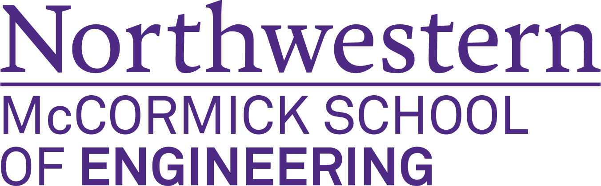

------
I am a second year Master's student, majoring in Computer Science from [Northwestern University](https://www.mccormick.northwestern.edu/computer-science/), working on developing secure-MPC Databases as a part of [Prof. Jennie Rogers'](http://users.eecs.northwestern.edu/~jennie/) research group. I am currently working in the capacity of a Graduate Research Assistant in the NSF-funded private data federation project: VaultDB, in collaboration with the [CAPriCORN initiative](https://www.capricorncdrn.org/), which is slated to be deployed on 5 major hospitals in the Chicagoland area. I completed my Bachelor's of Engineering (with HONORS) degree in Computer Science & Engineering from Rajiv Gandhi Technological Institute, India. My primary research domain comprises of <strong>Database Systems</strong> and <strong>Data Science</strong>.

I aim to contribute to developing massively distributed cloud database systems which can span the limitations of physical storage and proximity. Besides that, my summer of 2020 was spent developing a quantitative trading platform for Practicum LLC, through which I gained in-depth knowledge of web developement, financial market paradigms, and also got a chance to develop statisticlaly proven algortihms for first-time quant traders to experiment with.

Having previously collaborated on large codebases through my prior projects, I've developed a thorough understanding of fairly advanced concepts in programming, data structures, and algorithms, with JAVA being my core programming language. I've had an opportunity to develop and deploy scalable Distributed Systems, and have had an extensive project roster encompassing data science, algorithmic trading, and network analysis. I have previously worked on projects involving full-stack web development at scale.

Education
-----

**Master's of Science (MS)  Computer Science**
#### Northwestern University Sep 2019 - Dec 2020 (expected Graduation)
-----
<strong>GPA: </strong> 3.91/4.0  
<strong>Relevant Coursework: </strong>
Distributed Systems, Database Systems, Operating Systems, Cryptography, Intensive Program Design 
Data Science, Social Network Analysis, Machine Learning, Language Modelling, Intelligent Systems
<strong>Lab</strong>: Database Systems and Security Research Lab

-----

**Bachelor's of Engineering (BE HONS) Computer Science & Engineering**
#### Rajiv Gandhi Proudyogiki Vishwavidyalaya Aug 2015 - Jun 2019 
-----
<strong>CGPA: </strong> 8.63/10.0  
<strong>Relevant Coursework: </strong>
Algorithms, Data Structures, Cloud Computing, Object Oriented Design, Software Development Life Cycle  
<strong>Accolades:</strong> 
* *Finalist* - Smart India Hackathon, 2019 (Software Edition) 
* *Winner* - Wireless Robotics Competition, IIT - Kanpur (Zonal Round)

-----

Experience
-----

**Graduate Research Assistant,  Northwestern University**
#### Jan 2020 - Present
-----
I am part of Database systems research group here at Northwestern, working towards creating secure querying over federated databases (provided by [HealthLNK](https://www.healthinformationforall.org/project/healthlnk/)). My key responsibilities included developing and testing secure aggregate functionality, generating and deploying build pipleines using docker, among others. 
**Advisors:** [Prof. Jennie Rogers](https://www.mccormick.northwestern.edu/research-faculty/directory/profiles/rogers-jennie.html), [Prof. Xiao Wang](https://www.mccormick.northwestern.edu/research-faculty/directory/profiles/wang-xiao.html) (Co-Advisor)

-----

**Quantitative Developer/Backend Intern  Practicum LLC**
#### Jul 2020 - Sept 2020
-----
I worked as an algorithm developer realizing financial trading formuale and techniques in Python code in Jupyter Lab for the first half of the internship. The latter half comprised of developing backend using Flask, JSON and MySQL to work seemlessly with the pre-designed front end. By the end of this internship, my team was able to successfully create a platform for novice quant traders to learn and use algorithms with real-time stock data.

-----
