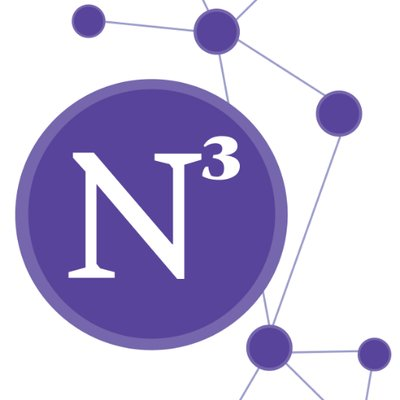

------
I am a Computer Science Master's (M.S.) candidate from [Northwestern University](https://www.mccormick.northwestern.edu/computer-science/), graduating March '21 and actively looking for full-time opportunities in either of the domains (or intersection) of Databases, Backend Development, Cloud, Network & Data Science. 
I'm part of [Prof. Jennie Rogers'](http://users.eecs.northwestern.edu/~jennie/) <strong>Database systems research group</strong> in the capacity of a Graduate Research Assistant. I've contributed to the <i>NSF-funded private data federation</i> project: VaultDB, which would help securely query distributed, multi-party hospital data under [CAPriCORN](https://www.capricorncdrn.org/), and is being deployed as a pilot project onto 2 major hospitals in Chicago. I am also concurrently collaborating with the Department of Sociology's N3 lab on an active policy research study, analyzing the social factors responsible for misconducts by Chicago Police Department (CPD) officers over the past 23 years using R's <i>social network analysis</i>. Prior to coming to the States, I completed my B.E. in Computer Science & Engineering (CSE) with an <i>HONORS</i> degree from Rajiv Gandhi Technological Institute, India in 2019.

My primary research domain comprises of <strong>Database Systems</strong> and <strong>Data Science</strong>.

Having previously worked with large codebases through my prior projects, I've developed a thorough understanding of fairly advanced concepts in programming, data structures, and algorithms, with <u>JAVA</u> being my core programming language. I was part of a team that developed a quantitative trading platform for a student-startup, through which I gained an in-depth knowledge of backend developement and financial market paradigms. Besides that, I've developed and deployed scalable Distributed Systems, and have an extensive project roster encompassing web development, systens design, data science, networks and people analytics at scale.

<strong>I have an ardent desire work at the intersection of Cloud and Databases to push the boundaries of their individual existing systems. 
I aim to contribute to developing massively distributed cloud database systems which can span the limitations of physical storage and proximity.</strong> 

Experience
-----

**Quantitative Data Analyst Institute for Policy Research (N3 Lab)**
#### Evanston, Illinois Dec 2020 - Present
-----
I am working on an active social policy research study at the [Northwestern Neighborhood and Network (N3) Initiative](https://sites.northwestern.edu/n3lab/) where I modelled the co-evolution of the Chicago Police Department’s official assignment & attendance network data with 22 years’ worth of police misconduct data ([Invisible Institute's CPDP](https://invisible.institute/police-data)) to analyze the formation, evolution and cross-network dependence of officer ties. My primary role was to define and calibrate network boundaries after extensive cleaning and detailed exploratory analysis in GCP’s BigQuery engine. I also managed to identify the individual, organizational, and neighborhood factors responsible for burgeoning misconduct through police networks using the [Goldfish library](https://github.com/snlab-ch/goldfish) in R. I'm currently working on adding additional network dynamic effects, ones which aren't included out-of-the-box but are critical to our further analysis, and contributing them to this open-source library in C++. 
**Mentor/PI:** [Prof. Andy Papachristos](http://www.papachristos.org/about.html)

-----

**Graduate Research Assistant Northwestern University**
#### Evanston, Illinois Jan 2020 - Present
-----
I am part of the Database systems research group at Northwestern, working towards creating operators for securely querying federated databases (provided by [HealthLNK](https://www.healthinformationforall.org/project/healthlnk/)) for hospitals in Chicagoland, as part of a pilot project. My key responsibilities included: 1. Developing and Testing aggregate functionality in secure and plaintext settings. 2. Generating and deploying build pipleine for the ubuntu VMs in Docker with all necessary dependencies to run secure multi-party computation. 3. Query plan enumeration to incorporate operator reordering for the query optemizer using Apache Calcite's algebra, among others. 
**Advisors:** [Prof. Jennie Rogers](https://www.mccormick.northwestern.edu/research-faculty/directory/profiles/rogers-jennie.html), [Prof. Xiao Wang](https://www.mccormick.northwestern.edu/research-faculty/directory/profiles/wang-xiao.html) (Co-Advisor)

-----

**Backend Engineering Intern/Quantitative Developer Practicum LLC**
#### St. Louis, Missouri (Remote) Jun 2020 - Aug 2020
-----
I spent summer of 2020 working as a backend developer. I conceptualized a solid schema design with future scalability in mind, and engineered it through endpoints in Flask, using JSON and MySQL to work seemlessly with the Figma-designed front end. The latter half comprised of realizing financial trading methodologies to Python code, where I led the translation of trading strategies like Statistical Arbitrage and Mean Reversion as a part-time quant developer. These were back-tested on 5 years of daily trade data from YahooFinance API resulting in gains of up to 5.76% over the naive approach. By the end of this internship, my team and I were able to successfully create a quant trading platform for first-time investors to learn market strategies and apply them using pre-coded algorithms on S&P 500 stocks (paper trade) in real-time.

-----

Education
-----

**Master's of Science (M.S.)  Computer Science**
#### Northwestern University, Evanston (IL) Sep 2019 - Mar 2021 (expected)
-----
<strong>GPA: </strong> 3.827/4.0  
<strong>Relevant Coursework: </strong>
Distributed Systems, Database Systems, Operating Systems, Intensive Program Design, Data Science, Social Network Analysis, Machine Learning Foundations, Statistical Language Modelling, Intelligent Information Systems 
<strong>Labs</strong>: Database Systems and Security Research Lab, Northwestern Neighborhood and Network Initiative

-----

**Bachelor's of Engineering (B.E. HONS) Computer Science & Engineering**
#### Rajiv Gandhi Proudyogiki Vishwavidyalaya, Bhopal (India) Aug 2015 - Jun 2019 
-----
<strong>CGPA: </strong> 8.63/10.0  
<strong>Relevant Coursework: </strong>
Algorithms, Data Structures, Cloud Computing, Object Oriented Design, Software Development Life Cycle  
<strong>Accolades:</strong>  * *Finalist* - Smart India Hackathon, 2019 (Software Edition)  * *Winner* - Wireless Robotics Competition, IIT - Kanpur (Zonal Round)

-----
